# 🎓 Base Learn Solutions - Complete All 13 Exercises!

<div align="center">


**Battle-tested smart contracts that successfully pass all Base Learn validations**

[🚀 Deploy](#-deployment-guide) • [📚 Contracts](#-contract-solutions) • [🏆 Rewards](#-what-youll-earn) • [💡 Tips](#-pro-tips)

</div>

---

## ✨ What You'll Earn

<table>
<tr>
<td width="33%" align="center">

### 🏅 13 NFTs
**Soulbound Tokens**  
Permanent proof of your smart contract mastery

</td>
<td width="33%" align="center">

### 👑 Guild Roles
**5 Achievement Tiers**  
Newcomer → Acolyte → Consul → Prefect → Supreme

</td>
<td width="33%" align="center">

### 💎 13 Points
**TalentProtocol**  
Build your on-chain developer reputation

</td>
</tr>
</table>

## 🎯 Why This Repository?

After hours of debugging and testing, I've compiled **working solutions** for all 13 Base Learn exercises. Each contract has been:

- ✅ **Deployed and verified** on Base Sepolia
- ✅ **Successfully minted** the corresponding NFT
- ✅ **Optimized** for gas efficiency
- ✅ **Documented** for learning

> 💡 **Note:** These are meant for learning! Understand the code before deploying.

## 📁 Contract Solutions

<details>
<summary><b>Click to see all 13 exercises with direct links</b></summary>

| # | Exercise | Contract | Quest Link | Key Concepts |
|---|----------|----------|------------|--------------|
| 01 | **Basic Math** | `BasicMath.sol` | [🔗 Quest](https://docs.base.org/base-learn/docs/contracts-and-basic-functions/basic-functions-exercise) | Overflow-safe arithmetic, error handling |
| 02 | **Control Structures** | `ControlStructures.sol` | [🔗 Quest](https://docs.base.org/base-learn/docs/control-structures/control-structures-exercise) | FizzBuzz, time-based logic, custom errors |
| 03 | **Storage** | `EmployeeStorage.sol` | [🔗 Quest](https://docs.base.org/base-learn/docs/storage/storage-exercise) | Storage optimization, packing, memory vs storage |
| 04 | **Arrays** | `FavoriteRecords.sol` | [🔗 Quest](https://docs.base.org/base-learn/docs/arrays/arrays-exercise) | Dynamic arrays, array manipulation |
| 05 | **Mappings** | `FavoriteRecords.sol` | [🔗 Quest](https://docs.base.org/base-learn/docs/mappings/mappings-exercise) | Mapping operations, nested mappings |
| 06 | **Inheritance** | `InheritanceContracts.sol` | [🔗 Quest](https://docs.base.org/base-learn/docs/inheritance/inheritance-exercise) | Contract inheritance, virtual/override |
| 07 | **Structs** | `GarageManager.sol` | [🔗 Quest](https://docs.base.org/base-learn/docs/structs/structs-exercise) | Custom data structures, struct arrays |
| 08 | **Error Triage** | `ErrorTriageExercise.sol` | [🔗 Quest](https://docs.base.org/base-learn/docs/error-triage/error-triage-exercise) | Debugging, error patterns, assembly |
| 09 | **New Keyword** | `AddressBookFactory.sol` | [🔗 Quest](https://docs.base.org/base-learn/docs/new-keyword/new-keyword-exercise) | Factory pattern, contract deployment |
| 10 | **Imports** | `ImportsExercise.sol` | [🔗 Quest](https://docs.base.org/base-learn/docs/imports/imports-exercise) | Libraries, code reuse, using for |
| 11 | **ERC-721** | `HaikuNFT.sol` | [🔗 Quest](https://docs.base.org/base-learn/docs/erc-721-token/erc-721-exercise) | NFT standard, OpenZeppelin, minting |
| 12 | **Minimal Token** | `UnburnableToken.sol` | [🔗 Quest](https://docs.base.org/base-learn/docs/minimal-tokens/minimal-tokens-exercise) | Basic token mechanics, transfers |
| 13 | **ERC-20** | `WeightedVoting.sol` | [🔗 Quest](https://docs.base.org/base-learn/docs/erc-20-token/erc-20-exercise) | Governance token, voting mechanics |

</details>

## 🚀 Deployment Guide

### Prerequisites

```bash
# 1. Clone this repository
git clone https://github.com/YOUR_USERNAME/base-learn-solutions.git
cd base-learn-solutions

# 2. Install dependencies
npm install

# 3. Set up your environment
cp .env.example .env
```

### Configure `.env`

```env
PRIVATE_KEY=your_private_key_here
BASE_SEPOLIA_RPC=https://sepolia.base.org
BASESCAN_API_KEY=your_basescan_api_key
```

> ⚠️ **Security:** Never commit your `.env` file!

### Deploy Contracts

<details>
<summary><b>Option 1: Deploy All Contracts</b></summary>

```bash
npx hardhat compile
npx hardhat run scripts/deploy-all.ts --network baseSepolia
```

</details>

<details>
<summary><b>Option 2: Deploy Individual Contracts</b></summary>

```bash
# Compile first
npx hardhat compile

# Then deploy specific contract
npx hardhat run scripts/deploy-01-basicmath.ts --network baseSepolia
```

</details>

## 📝 Submission Process

```mermaid
graph LR
    A[Deploy Contract] --> B[Copy Address]
    B --> C[Visit Base Learn]
    C --> D[Submit Address]
    D --> E[Mint NFT! 🎉]
```



1. **Deploy** your contract to Base Sepolia
2. **Copy** the contract address from terminal
3. **Navigate** to [Base Learn](https://docs.base.org/base-learn/docs/welcome)
4. **Paste** address and submit
5. **Mint** your NFT!

## 💡 Pro Tips

### 🎯 Common Issues & Solutions

| Issue | Solution |
|-------|----------|
| **"Unable to estimate gas"** | Contract validation failed - check function signatures |
| **"Transaction underpriced"** | Previous transaction pending - wait or increase gas |
| **Contract not verifying** | Ensure exact function names and parameters match |
| **Imports failing** | Deploy library contract first, then main contract |

### 🔥 Speed Run Strategy

1. **Batch Operations:** Deploy 3-4 contracts at once
2. **Use Remix:** For quick testing before Hardhat deployment
3. **Pre-fund Wallet:** Have enough Base Sepolia ETH ready
4. **Keep Tab Open:** Stay logged into Base Learn platform

### 🛡️ Security Best Practices

- ✅ Use a **dedicated testnet wallet**
- ✅ Store keys in `.env`, never hardcode
- ✅ Verify contracts on BaseScan after deployment
- ✅ Test locally with `npx hardhat test` first

## 📚 Resources

<table>
<tr>
<td width="50%">

### Official Links
- 🌐 [Base Learn Platform](https://docs.base.org/base-learn/docs/welcome)
- 🔗 [Base Documentation](https://docs.base.org/)
- 💧 [Base Sepolia Faucet](https://www.coinbase.com/faucets/base-ethereum-goerli-faucet)
- 🔍 [BaseScan Explorer](https://sepolia.basescan.org)

</td>
<td width="50%">

### Community
- 🏰 [Guild.xyz Base Learn](https://guild.xyz/base-learn)
- 💬 [Base Discord](https://discord.gg/base)
- 🐦 [Base Twitter](https://twitter.com/base)
- 📖 [OpenZeppelin Docs](https://docs.openzeppelin.com/)

</td>
</tr>
</table>

## 🤝 Contributing

Found a better solution? Contributions are welcome!

```bash
# 1. Fork the repository
# 2. Create your feature branch
git checkout -b feature/better-solution

# 3. Commit your changes
git commit -m '✨ Improve Exercise X solution'

# 4. Push and create PR
git push origin feature/better-solution
```

## 📜 License

MIT License - Use freely to complete Base Learn!

## 🙏 Acknowledgments

<div align="center">

**Special thanks to:**

Base Learn Team • OpenZeppelin • Hardhat • The Base Community

---

### 🌟 Star this repo if it helped you earn your NFTs!

Made with ❤️ by a Base Learn Graduate

**[⬆ back to top](#-base-learn-solutions---complete-all-13-exercises)**

</div>